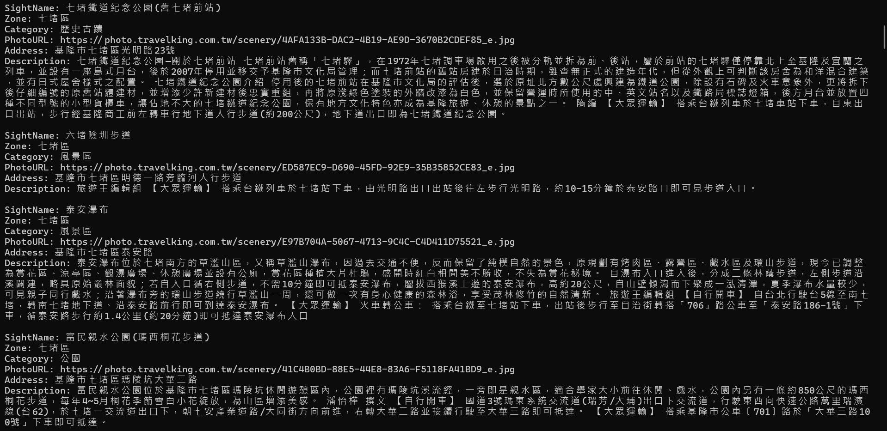
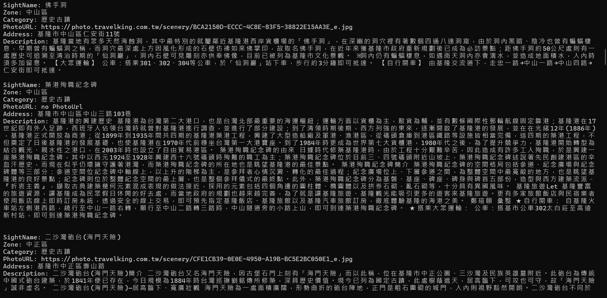

HW1:網頁爬蟲練習
---
### 1.系統功能
+ 爬取https://www.travelking.com.tw/tourguide/taiwan/keelungcity/ 網頁內基隆市所有地區的景點內容。

### 2.架構概覽
+ Main.java : 程式執行入口，負責呼叫爬蟲。
+ KeelungSightsCrawler.java : 爬蟲邏輯。
+ Sight.java : 儲存爬蟲抓下來的景點資訊。

### 3.環境需求
+ JDK : 25
+ Maven : 3.0.0

### 4.安裝與執行步驟
1. 確保已安裝 JDK 25 與 Maven。
2. 開啟終端機並進入hw1目錄，輸入 ```mvn clean compile exec:java```

### 5.截圖
+ 
+ 

### 6.公開網址
+ ```https://github.com/iamnjrgfy/2026-Summer-assignments```


