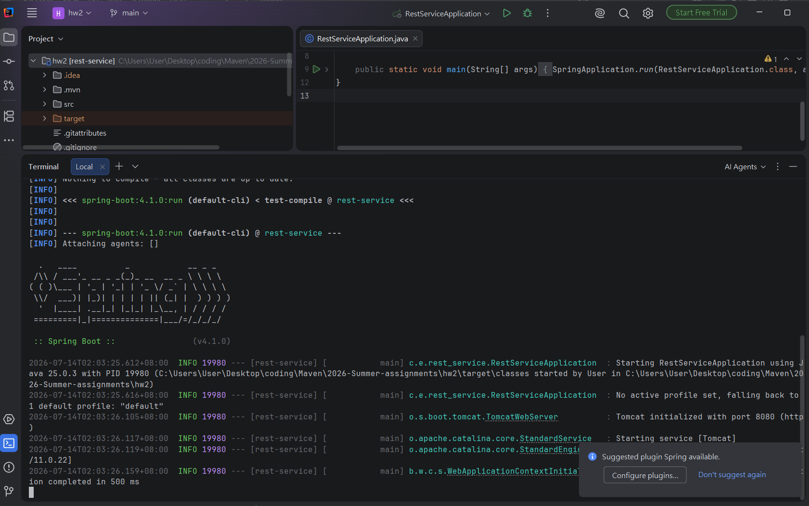
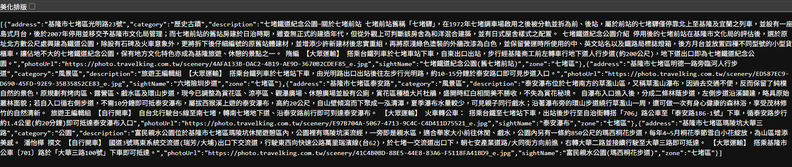

HW2 基隆景點查詢WebAPI
---
本作業使用Sprint boot 開發 RestfulAPI，提供基隆市各個行政區景點的查詢服務。

### 1. 系統功能
+ 提供基隆七個區域 (中山、信義、仁愛、中正、安樂、七堵、暖暖) 之景點查詢API。
+ 接收GET請求並回傳標準JSON格式資料
+ 自動處理路徑參數

### 2. 架構概覽
+ 後端框架：Spring boot
+ 建構工具：Maven(使用Maven Wrapper管理)
+ 語言：Java
+ 架構模式：MVC (Controller-Service-Repository)
### 3.版本需求
+ java：25.0.3
+ Maven：3.9.16 (由 Maven Wrapper 透過 Maven Wrapper 自動管理，無需額外安裝)
### 4.安裝與執行步驟
1. 確保安裝JDK 25版本
2. 啟動Termainal進入hw2目錄

3. 執行以下指令啟動伺服器
 ```bash 
    .\mvnw.cmd spring-boot:run 
 ``` 
### 4. 伺服器啟動後，請於瀏覽器訪問：
[http://127.0.0.1:8080/api/sights/](http://127.0.0.1:8080/api/sights/){zone}
### 5. 測試方式
1. 使用瀏覽器輸入網址：`http://127.0.0.1:8080/api/sights/{zone}`
   * `zone` 可選填：`qidu`, `zhongshan`, `zhongzheng`, `renai`, `anle`, `xinyi`, `nuannuan`
   * 例如，查詢七堵區：
     `http://127.0.0.1:8080/api/sights/qidu`
2. 若頁面回傳 JSON 格式的景點資料，即代表系統運作正常。
### 6.API範例
+ Endpoint：GET /api/sights/{zone}
+ Request 範例：[http://127.0.0.1:8080/api/sights/nuannuan](http://127.0.0.1:8080/api/sights/nuannuan)
+ Response 範例：[{"address":"基隆市暖暖區東勢街","category":"風景區","description":"在基隆市暖暖區東邊山區與新北市十分寮僅一山之隔的東勢坑，有一處名為「暖東峽谷」的幽靜峽谷。山谷底下有淺淺清澈的溪流，谷中怪石嶙峋，溪邊有峭壁、岩洞，峭壁上還有一個蝙蝠洞，傳說有蝙蝠棲息經常有蝙蝠出入洞口，蔚為奇觀十分雄奇、壯觀，峽谷區內的林相完整，以筆筒樹為大宗。 循著石梯往上走可通往觀景區，沿途有原木建造而成的觀景亭，在此可欣賞瀑布、觀賞溪谷之美。溪流清澈見底，適合捉魚撈蝦、戲水等活動，也是炎炎夏日避暑的勝地。 旅遊王編輯組 ★ 自行開車 1、國道一號：由東北角（濱海）交流道下，右轉往八堵方向即可到達暖東峽谷。 2、國道一號：由東北角海岸交流道下，轉東勢街即可到達暖東峽谷。 3、國道一號：由八堵交流道下，走102乙縣道至暖暖區，再接東勢街左行至東勢坑村即可到達暖東峽谷。 ★ 大眾運輸 公車─由基隆市搭乘市公車603路往東勢坑方向之班車至終點站即可到達暖東峽谷。","photoUrl":"https://photo.travelking.com.tw/scenery/6E576D56-7736-41BC-AB5E-EE24A28E5B31_e.jpg","sightName":"暖東峽谷","zone":"暖暖區"}]
系統截圖

### 7.系統截圖
* 

+ 

