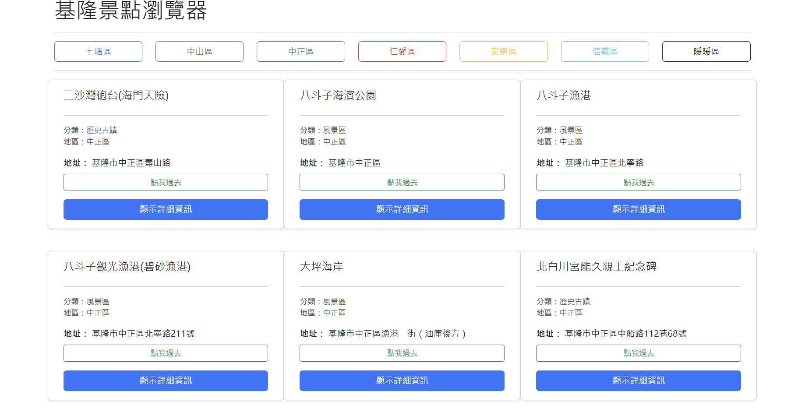

基隆景點搜尋系統 (Keelung Sights Browser)
---

### 1. 系統功能
+ 景點瀏覽：依據不同行政區篩選基隆市的旅遊景點。
+ 即時搜尋：透過 AJAX 非同步請求，即時取得後端資料庫中的景點資訊。
+ 地圖連結：每個景點皆附有 Google Maps 定位連結，方便使用者導航。

### 2. 架構改覽
+ 前端 (Frontend)：HTML5, CSS3 (Bootstrap 5), jQuery, AJAX。
+ 後端 (Backend)：Java Spring Boot 搭配 RESTful API。

### 3.版本需求
+ java：25.0.3
+ Maven：3.9.16 (由 Maven Wrapper 透過 Maven Wrapper 自動管理，無需額外安裝)

### 4. 安裝與執行步驟
1. 後端啟動：進入 backend 並執行
     ```bash 
        cd backend
        .\mvnw.cmd spring-boot:run 
     ``` 
2. 前端執行
    + 請使用 VS Code 的 Live Server 擴充功能開啟 frontend/index.html。
    + 建議網頁網址為 [http://127.0.0.1:5500](http://127.0.0.1:5500)
### 5. 測試方式

+ 啟動後端服務，確認 [http://127.0.0.1:8080](http://127.0.0.1:8080) 可連線。

+ 開啟前端網頁，點擊選單中的行政區。

+ 若畫面成功顯示景點卡片，即代表測試通過。

### 6. API 範例
+ 本專案使用以下 API 接口進行資料獲取：

    + 取得指定區域景點：GET [http://127.0.0.1:8080/api/sights/](http://127.0.0.1:8080/api/sights/){zone}

範例：GET [http://127.0.0.1:8080/api/sights/qidu](http://127.0.0.1:8080/api/sights/qidu)

### 7. 截圖
* 

### 8. 已知限制 (技術備註)
+ 瀏覽器安全性限制：由於瀏覽器「同源政策 (Same-Origin Policy)」限制，直接以 file:/// 協定開啟前端檔案會導致 AJAX 請求失敗。請務必透過 Web Server 工具 (如 Live Server) 執行。

+ CORS 配置：後端已設定 origins = "*"，以確保前端在不同開發環境 (Port) 下皆能正常存取 API。
