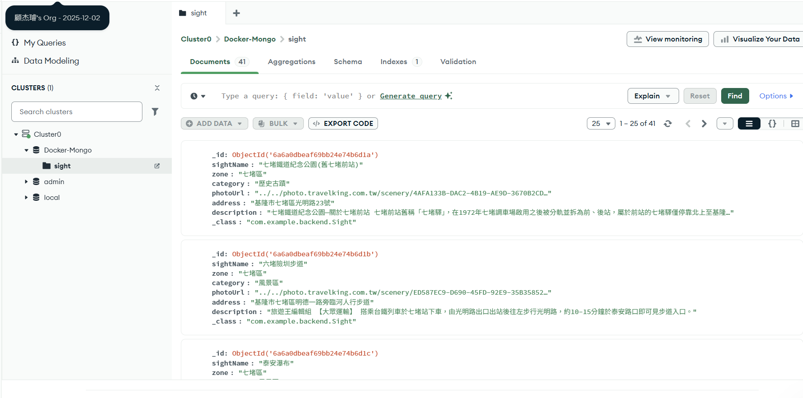

#  Web API 連結 Mongo 資料庫練習


這是一個基於 **Spring Boot** 與 **MongoDB Atlas** 開發的後端系統，並結合前端網頁提供使用者快速查詢各地區景點、檢視詳細資訊的互動式平台。

---

## 1. 系統功能

1. **景點資料自動初始化**：系統啟動時自動檢查並將預設景點資料匯入資料庫。
2. **區域景點查詢**：支援依行政區（如：中正區等）快速篩選並回傳景點清單。
3. **雲端資料庫支援**：採用 MongoDB Atlas 雲端資料庫，確保資料持久化與高可用性。
4. **即時前端互動**：透過前端頁面與 API 進行非同步互動，提供極速的查詢體驗。

---

## 2. 架構概覽

本專案採用經典的 **MVC / 三層式架構 (Layered Architecture)** 進行開發：

* **Controller 層**：負責接收前端的 HTTP 請求，並回傳 JSON 格式的 API 資料。
* **Service 層**：處理系統核心商業邏輯、資料處理與初始化。
* **Repository (Data Access) 層**：透過 Spring Data MongoDB 與雲端資料庫進行溝通與 CRUD 操作。
* **Database**：MongoDB Atlas (NoSQL 雲端集群)。

---

## 3. JDK / Maven 版本

運行本專案所需的建議環境版本：

* **JDK**：Java 25 
* **Maven** ：3.9.16
* **Spring-Boot**：4.1.0

## 安裝與執行步驟
### 1. 進入 backend 目錄並執行專案

開啟終端機（Terminal）並切換至 `backend` 資料夾，依序執行以下指令：

```bash
cd backend
mvn clean install
mvn spring-boot:run
```
### 2. 前端互動測試

請透過以下步驟驗證前端頁面是否正常運作：

1. **啟動前端頁面**
   * 進入 `frontend` 資料夾，並使用 **Live Server**（例如 VS Code 的 Live Server 套件）開啟 `index.html`。
2. **操作與驗證**
   * 在瀏覽器開啟的前端網頁中，點擊選單中的任一行政區。
   * **驗證結果**：若畫面成功即時顯示對應的景點卡片，即代表測試通過！
---

## 4. API 範例

本專案提供以下 API 接口供前端進行資料獲取：

* **取得指定區域景點**
  * **請求方法**：`GET`
  * **API 路徑**：`http://127.0.0.1:8080/api/sights/{zone}`
  * **請求範例**：`http://127.0.0.1:8080/api/sights/qidu`

## 5. 系統截圖

* **前端網頁與景點查詢畫面**
  > 


